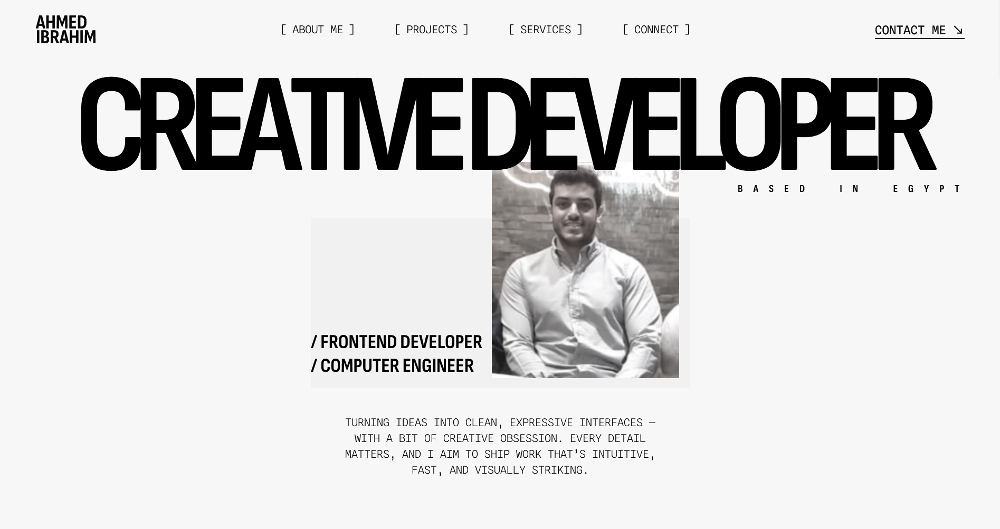
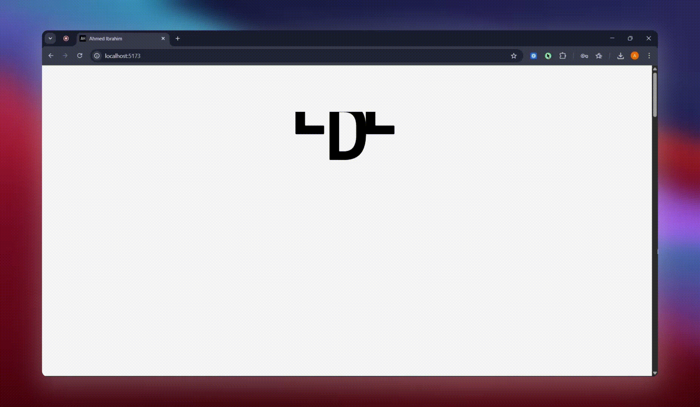

# 🎨 Frontend Developer Portfolio

A highly animated, performance-optimized portfolio built to showcase modern frontend engineering skills, clean architecture, and smooth user experiences.



<details open>

</details>
[Live Preview](https://ah-ibrahim.vercel.app/)

---

## 📋 Table of Contents

- [About](#-about)
- [Tech Stack](#%EF%B8%8F-tech-stack)
- [Features](#-features)
- [Getting Started](#%EF%B8%8F-getting-started)
- [Project Structure](#project-structure)
- [License](#-license)
- [Credits](#-credits)
- [Authors](#%EF%B8%8F-authors)

---

## 👋 About

This is **my personal frontend developer portfolio**, designed to do more than just show pretty screens.

It demonstrates:

- 💎 **Polished, high-impact animations** that bring the UI to life
- 🏗️ **Clean, scalable architecture** built with React and TypeScript
- ⚡ **Performance-first mindset**, with lazy loading and optimized assets

Every section is **interactive, data-driven, and animation-rich**, showing that I don’t just code — I craft experiences.

---

## 🛠️ Tech Stack

Here’s what’s under the hood:

- **React** – UI development
- **TypeScript** – Type safety & maintainability
- **Tailwind CSS** – Utility-first styling
- **GSAP** – Advanced animations & scroll interactions
- **Zod** – Runtime schema validation
- **JSON** – Data-driven content structure
- **Vite** – Fast development & build tooling

---

## ✨ Features

Some cool stuff this project can do:

- ⚡ Animation-heavy UI using GSAP
- 🧠 Scroll-based and timeline animations
- 🎬 Intro animations and section reveals
- 📱 Fully responsive across devices
- 💤 Lazy loading for performance optimization
- 📦 JSON-based data (projects, services)
- 🔒 Type-safe data validation with Zod
- 🧼 Clean, modular component structure

---

## ⚙️ Getting Started

Wanna run this locally? Follow these steps:

1. Clone the repo

```bash
git clone https://github.com/Ah-Ibrahim/Portfolio-v1.git
cd Portfolio-v1

```

2. Install dependencies

```bash
npm install
```

3. Start the app

```bash
npm run dev
```

---

## Project Structure

```
src/
├── assets/           # Images, fonts, static assets
├── components/       # Reusable UI components
|   ├─ common/        # General-purpose reusable components
|   ├─ ui/            # Buttons, cards, inputs, modals
|   └─ layout/        # Navbar, Footer, Section wrappers
├── data/             # JSON-based content
├── hooks/            # Custom React hooks
├── lib/
|   ├─ utils/         # Helper functions
|   └─ schemas/       # Zod schemas
├── pages/            # Page-level components
├── features/         # Page-specific logic grouped by domain
├── App.tsx
└── main.tsx
```

---

## 📄 License

This project is licensed under the MIT License.
Feel free to do what you want with it.

---

## 🙏 Credits

Big thanks to:

- Icons from [Remix](https://remixicon.com/)

---

## ✍️ Authors

Ahmed Ibrahim
